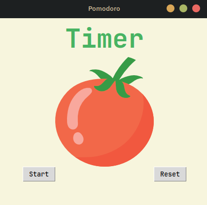
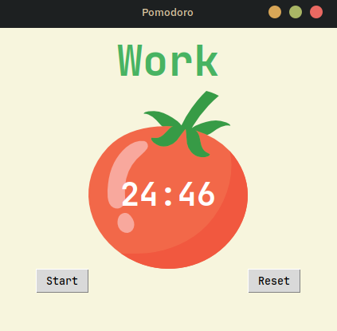
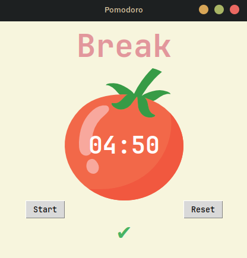

# Pomodoro-Timer ⏰

A simple Pomodoro timer built in Python using the Tkinter library.

## Features

- **Work/Break Cycles:** Automatically cycles between 25-minute work sessions, 5-minute short breaks, and a 20-minute long break after four work sessions.
- **Visual Timer:** Displays a countdown timer and a tomato-themed UI.
- **Progress Tracking:** Shows checkmarks for each completed work session.
- **Reset Functionality:** Easily reset the timer and progress at any time.

## Screenshots





## Getting Started

### Prerequisites

- Python 3.x installed on your system.

### How to Run

1. **Clone or download this repository.**
2. **Navigate to the project directory in your terminal.**
3. **Run the application:**
    ```sh
    python main.py
    ```

### Notes

- Make sure the `assets/tomato.png` image is present in the `assets` folder, as it is required for the UI.
- No additional dependencies are required beyond the Python standard library.

## How It Works

- Click **Start** to begin a Pomodoro session.
- The timer will automatically switch between work and break periods.
- Checkmarks will appear after each completed work session.
- Click **Reset** to stop the timer and clear progress.

---

Enjoy your productivity